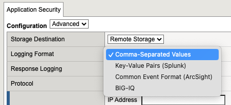
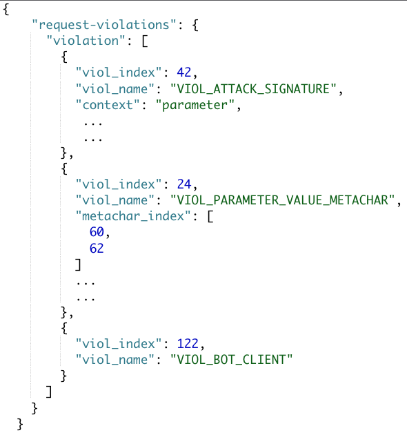

# Enhancing BIGIP ASM logs with Logstash

For remote logging, F5 ASM supports multiple formats in order to accomodate sending the logs to a variaty of SIEM solutions. These formats include:
- Key-Value Pairs (Splunk)
- Common Event Format (Arcsight)
- BIGIQ
- Comma Separated Values (CSV, which is the default logging format).

  


Out of the four options only CSV is the only logging format that allows you to select specific fields (out of a 70+ total fields) along with a customized logging format.
In addition it provides access to `violation_details` field that Key-Value and CEF formats do not provide. Violation details, in BIG-IP 13.x and higher provides the complete violation details in an XML format (https://my.f5.com/manage/s/article/K9435). For example, on a attack signature (VIOL_ATTACK_SIGNATURE) violation, you should expect to find the name of the entity that the signature was detected on (parameter, cookie, header), the entity value that matched the signature, but also things like staging, enforcement_level, etc. With a VIOL_PARAMETER_VALUE_METACHAR violation, you should expect to find information regarding the meta-char Hex number as well as the entity name the it was detected on (e.g parameter name). The values within the `violation_details` XML are base64 decoded. 
An example of the `violation_details` field looks as follows: 

```xml
<?xml version='1.0' encoding='UTF-8'?><BAD_MSG><violation_masks><block>4100010c03c0c00-3a03030830000072-8000000000000000-0</block><alarm>475f0ffcbbd0fea-befbf358b000007e-f000000000000000-0</alarm><learn>0-0-0-0</learn><staging>0-0-0-0</staging></violation_masks><request-violations><violation><viol_index>42</viol_index><viol_name>VIOL_ATTACK_SIGNATURE</viol_name><context>parameter</context><parameter_data><value_error/><enforcement_level>global</enforcement_level><name>dGVzdA==</name><auto_detected_type>alpha-numeric</auto_detected_type><value>PHNjcmlwdD4=</value><location>query</location><expected_location></expected_location><is_base64_decoded>false</is_base64_decoded><param_name_pattern>*</param_name_pattern><staging>0</staging></parameter_data><staging>0</staging><sig_data><sig_id>200001475</sig_id><blocking_mask>3</blocking_mask><kw_data><buffer>dGVzdD08c2NyaXB0Pg==</buffer><offset>6</offset><length>7</length></kw_data></sig_data><sig_data><sig_id>200000098</sig_id><blocking_mask>3</blocking_mask><kw_data><buffer>dGVzdD08c2NyaXB0Pg==</buffer><offset>5</offset><length>7</length></kw_data></sig_data></violation><violation><viol_index>24</viol_index><viol_name>VIOL_PARAMETER_VALUE_METACHAR</viol_name><parameter_data><value_error/><enforcement_level>global</enforcement_level><name>dGVzdA==</name><auto_detected_type>alpha-numeric</auto_detected_type><value>PHNjcmlwdD4=</value><location>query</location><expected_location></expected_location><is_base64_decoded>false</is_base64_decoded></parameter_data><wildcard_entity>*</wildcard_entity><staging>0</staging><language_type>4</language_type><metachar_index>60</metachar_index><metachar_index>62</metachar_index></violation><violation><viol_index>122</viol_index><viol_name>VIOL_BOT_CLIENT</viol_name></violation></request-violations></BAD_MSG>
``` 

Within the repo we will take you though the process of you you can:
- Create a custom CSV logging format on ASM 
- Setup a logstash isntance to receive the ASM log
- Transform the CSV log fields to values you SIEM can undsterstand eassily 
- Send the transformed log to your SIEM of choice.


## Step 1. Configure Logging profile for BIGIP

On BIGIP go to Event Logs -> Logging Profiles and create a new profile.
Select the following variables:
- Application Security:	Enabled
- Storage Destination: Remote Storage
- Logging Format: Comma-Separated Values
- Protocol: TCP
- Storage Format:  User-Defined
```
date_time="%date_time%",is_truncated="%is_truncated%",ip_client="%ip_client%",vs_name="%vs_name%",dest_port="%dest_port%",attack_type="%attack_type%",blocking_exception_reason="%blocking_exception_reason%",method="%method%",policy_name="%policy_name%",protocol="%protocol%",request_status="%request_status%",responseCode="%response_code%",severity="%severity%",sig_cves="%sig_cves%",sig_ids="%sig_ids%",sig_names="%sig_names%",sig_set_names="%sig_set_names%",sub_violations="%sub_violations%",support_id="%support_id%",threat_campaign_names="%threat_campaign_names%",unit_hostname="%unit_hostname%",url-decode="%uri%",violation_rating="%violation_rating%",x_forwarded_for_header_value="%x_forwarded_for_header_value%",violations="%violations%",violation_details="%violation_details%",request="%request%"
```
- Maximum Request Size: 2048	
- Maximum Entry Length: 10K


## Step 2. Setup Logstash to receive the logs from BIGIP

While you have multiple option on how to run Logstash, for simplicity purposes we will document the docker option. As a pre-requisite you need to have the docker and docker-compose installed on your machine. 

### Clone the repo

Clone this repo to your local machine using `https://github.com/skenderidis/bigip-logs` and switch the working directory to be `bigip-logs`

```shell
git clone https://github.com/skenderidis/bigip-logs
cd bigip-logs
```

### Install Logstash using docker-compose

```shell
TZ=Asia/Dubai && docker-compose up -d
```

NOTES:
>  - Change the timezone used in the docker containers by altering the inline environment variable in the command above accordingly to your location. A list of TZ Database Names can be found [here](https://en.wikipedia.org/wiki/List_of_tz_database_time_zones).
>  - The TCP port that Logstash is listening to is 8515. This can be changed from the `docker-compose.yaml` file. 


## Step 3. Understanding logstash.conf

In this section we will go through the most important parts of the `logstash.conf`.

### Input 
This is were you can define the post and type of the information you expecting Logstash to receive. In our case, it listens on port 8515 and it is expecting syslog messages.  
```
input {
  syslog {
    port => 8515
    codec => plain {
      charset => "ISO-8859-1"
    }
  }
}
```

### Grok 
Grok is a great way to parse unstructured log data into something structured and queryable. Grok works by combining text patterns into something that matches your logs.
In our configuration we are using Grok to match the fields that have been configured on ASM CSV logging format.

```js
 grok {
   match => {
     "message" => [
        ",attack_type=\"%{DATA:attack_type}\"",
        ",blocking_exception_reason=\"%{DATA:blocking_exception_reason}\"",
        ",date_time=\"%{DATA:date_time}\"",
        ",serverIp=\"%{DATA:dest_ip}\"",
        ",dest_port=\"%{DATA:dest_port}\"",
        ",clientIp=\"%{DATA:ip_client}\"",
        ",is_truncated=\"%{DATA:is_truncated}\"",
        ",method=\"%{DATA:method}\"",
        ",policy_name=\"%{DATA:policy_name}\"",
        ",protocol=\"%{DATA:protocol}\"",
        ",requestStatus=\"%{DATA:request_status}\"",
        ",request=\"%{DATA:request}\"",
        ",request_body_base64=\"%{DATA:request_body_base64}\"",
        ",response_code=\"%{DATA:response_code}\"",
        ",severity=\"%{DATA:severity}\"",
        ",sig_cves=\"%{DATA:sig_cves}\"",
        ",sig_ids=\"%{DATA:sig_ids}\"",
        ",sig_names=\"%{DATA:sig_names}\"",
        ",sig_set_names=\"%{DATA:sig_set_names}\"",
        ",src_port=\"%{DATA:src_port}\"",
        ",staged_sig_cves=\"%{DATA:staged_sig_cves}\"",
        ",staged_sig_ids=\"%{DATA:staged_sig_ids}\"",
        ",staged_sig_names=\"%{DATA:staged_sig_names}\"",
        ",staged_threat_campaign_names=\"%{DATA:staged_threat_campaign_names}\"",
        ",sub_violations=\"%{DATA:sub_violations}\"",
        ",support_id=\"%{DATA:support_id}\"",
        ",threat_campaign_names=\"%{DATA:threat_campaign_names}\"",
        ",unit_hostname=\"%{DATA:unit_hostname}\"",
        ",uri=\"%{DATA:uri}\"",
        ",violations=\"%{DATA:violations}\"",
        ",violation_details=\"%{DATA:violation_details_xml}\"",
        ",violation_rating=\"%{DATA:violation_rating}\"",
        ",virtualServerName=\"%{DATA:vs_name}\"",
        ",x_forwarded_for_header_value=\"%{DATA:x_forwarded_for_header_value}\""
     ]
   }
   break_on_match => false
 }
```

### Converting violation details from XML to JSON 
If violation_details field exists, then we are converting it from XML to JSON in order to be able to parse easier later on.
```
  if [violation_details_xml] != "N/A" {
    # change from XML to JSON Obj
    xml {
      source => "violation_details_xml"
      target => "violation_details"
      remove_namespaces => true
			force_array => false
    }
  }
```

### GeoIP
In the next section we are using the GeoIP functionality of Logstash to create a GeoHash for the client IP address. This will allow us to display a Geolocation Map with the origin of the clients. 
The first part of the code, determines if the client-IP is set as an XFF header value in order to extract the IP details from there, while the second part tries to determine if the client is coming from an Internal IP so that it skips Geo Tagging that particular IP. 

```js
  if [x_forwarded_for_header_value] != "N/A" {
    mutate { add_field => { "source_host" => "%{x_forwarded_for_header_value}"}}
  } 
  else {
    mutate { add_field => { "source_host" => "%{ip_client}"}}
  }

  cidr {
    address => [ "%{source_host}" ]
    add_tag => [ "internalIP" ]
    network => [ "10.0.0.0/8", "172.16.0.0/12", "192.168.0.0/16" ]
  }
  if "internalIP" not in [tags] {
    geoip {
      source => "source_host"
      ecs_compatibility => disabled
    }
  } 
```

### Mutating fields
In the following section we perform general mutations on the ASM fields, like substituting `"` for `'` with `gsub`, splitting arrays into comma separated values with split and last removing fields that we don't need any more.  

```js
  mutate {
    gsub => ["sig_names","%22","'"]
    split => { "attack_type" => "," }
    split => { "sig_cves" => "," }
    split => { "sig_ids" => "," }
    split => { "sig_names" => "," }
    split => { "sig_set_names" => "," }
    split => { "staged_sig_cves" => "," }
    split => { "staged_sig_ids" => "," }
    split => { "staged_sig_names" => "," }
    split => { "staged_threat_campaign_names" => "," }
    split => { "sub_violations" => "," }
    split => { "threat_campaign_names" => "," }
    split => { "violations" => "," }
    remove_field => [
      "[violation_details][violation_masks]",
      "violation_details_xml",
      "message", "priority","facility","facility_label", "log", "[event][original]",
      "[geoip][postal_code]","[geoip][region_code]","[geoip][timezone]",
      "[geoip][city_name]","[geoip][continent_code]","[geoip][country_code3]"
    ]
  }
```

### Creating a cloned log for further processing. 
The following configuration will create a full clone of the log, while keeping the original log intact. It will also add a tag (decoded) so that we can identify the clone from the original.

```js
  if [violation_details][request-violations] {
    clone {  
        clones => ["decoded"]
        add_field => { "decoded" => "yes" }
    }
  }
```


### Transforming the Violations_details fields for the cloned log.
For the cloned log, we are executing the ruby script to change the base64 decode the values. Based on the violation type we are parsing/modifying the appropriate fields.

```js
 ruby {
    code => "
            require 'base64';
            type = event.get('[decoded]');
            data = event.get('[violation_details][request-violations]');
            ...
            ...
            ...
          
```


### Splitting the cloned log into multiple logs. 
In the violation_details field (now converted to JSON) we will have an array of all the request-violations that have been identified on the specific HTTP transaction (like shown below).



If the cloned log has multiple request violations, then we create a separate log for each request violation. This suggested as we can aggreate the logs easier and very create useful reports for the teams that are analyzing the data. 

```js
  if "decoded" in [tags] 
  {
    if [details][0] { 
      split {
        field => ["[details]"]
      }
    }
    mutate {
      copy => { "[details][sig_data][sig_id]" => "[sig_id]" }
      remove_field => [
        "violation_details", "bot_anomalies","enforced_bot_anomalies", "client_application","bot_category",
        "sig_set_names","sig_names","client_application_version","sig_ids", "violations","request","geoip", "decoded"
      ]
    }
  }
```

### Output of the logs 
Currently the output configuration is as follows:

```
output {
  if "decoded" in [tags] 
  {
    elasticsearch {
      hosts => ["elasticsearch:9200"]
      index => "waf-decoded-logs-%{+YYY.MM.dd}"
    }
  }
  else{
    elasticsearch {
      hosts => ["elasticsearch:9200"]
      index => "waf-logs-%{+YYY.MM.dd}"
    }
  }
}
```

Open the logstash.conf and modify the output plugin for the configuration. If you are using elasticseach you just need to change the hostname/IP of Elastiseach, but if you are using another SIEM solution you need to modify the output accordingly. More information on logstash output plugins can be found on (https://www.elastic.co/guide/en/logstash/current/output-plugins.html)


## Step 4.  Configuring index for Elastic (Only if you are using ELK)

Create index templates for on Elasticsearch

```shell
curl -d "@index-template.json" -H 'Content-Type: application/json' -X PUT 'http://ELASTIC_IP:9200/_index_template/bigip-waf-logs'
```
Expected Response: `{"acknowledged":true}`


## Step 5.  Importing Grafana Dashboards that work with Elasticsearch

TBD.


# Support

Please open a GitHub issue for any problem or enhancement you might need.

